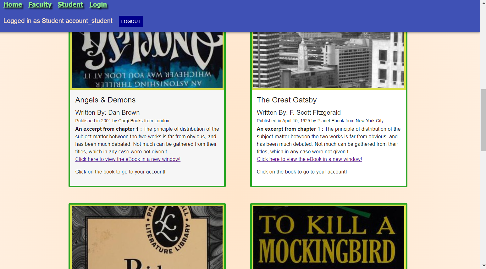
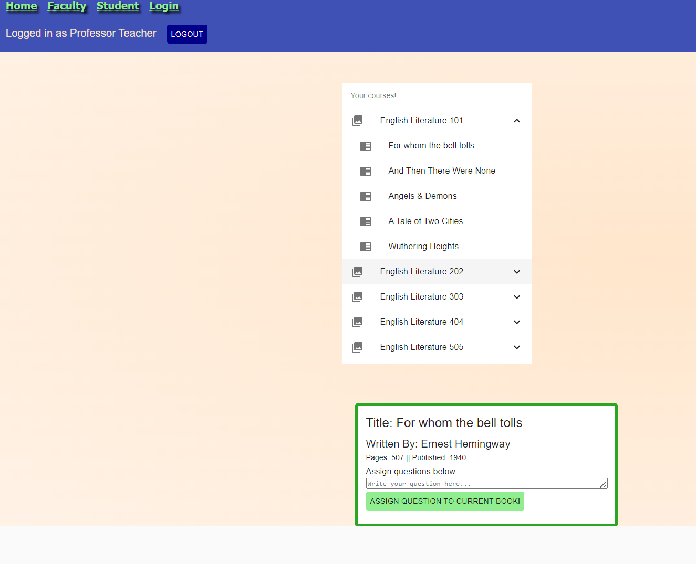

# University Project

This is a single page application that allows the user to look at a random selection of books available in the courses offered at the mini-school from the home page. There is functionality which allows creating an account with a teacher or student role as well as a login page to change the users rights. There are two components, one for faculty members and one for students, that allows the user to display all books in all courses. The faculty members can assign questions to each book and the students can answer all assignments assigned to a book.
  

## Table of Contents


- [Features](#Features)

- [Installation](#installation)

- [Usage](#usage)

- [Description](#Description)

- [Instructional-GIF](#Instructional-GIF)

- [Video-Describing-Functionality](#Video-Describing-Functionality)

- [Credits](#Credits)

- [License](#License)

- [Badges](#Badges)

  

## Features

  

1. From the home page, the user can view a random book from each of the 5 English courses available from the SPA. Upon render of the home page, a new random number selects a different book from each course and displays it as a card. Clicking on each card will direct the user to the login page. Each card has a link that will direct the user **outside of the SPA** to a website with a pdf of the book.

2. The login page offers a link to a signup page. The signup page checks for a valid password and upon a successful sign up will redirect to the login page. The login page takes a username, password and user role, then will redirect to the correct users page, either faculty or student.

3. The faculty page lists a menu for all courses, expanding the course item will list a menu of each book in the course. Each book item in the expanded list is a link to render a card including that books information. The information for the card is derived from the parameters of the URL. Each card allows the teacher to enter a question and submit to the curriculum for that book.

4. The student page lists a menu for all courses, expanding the course item will list a menu of each book in the course. Each book item in the expanded list is a link to render a card including the books information. The information for the card is derived from the parameters of the URL. Each card allows the student to list the next question assigned to the book that has not been answered. The student is then able to submit an answer to that question.

  

## Installation

  

This is an SPA that simulates a learning experience on canvas or a similar online school. Clone the repository to your machine and run the node installation command below to install the necessary dependencies.
```js
npm install
```
It is built with the React framework and must be initialized by running the following command.
```js
npm start
```
It is accessible through a local browser and the data is established on a local JSON file using relative paths. The JSON server must be started before use by running the following command.
```js
npm run server
```
Now you're ready to learn or teach at an english program in a made up school.

Clone the repo [from Github here](https://github.com/Bambam320/phase-2-miniSchool-project)

  

## Usage

The SPA's functions are described below with imagery and code to best demonstrate their use.

**SPA Component Tree**

#### The component tree includes an index file that attaches the react app to the DOM. Then an "App" component provides context and routing for all children elements. The first is a "NavBar" component that lists links and is parent to the "LogginIn" component. The second is the "Home" component which displays the main page and calls the "HomeCard" child which lists a card for each book provided to it. The third is the "Faculty" component which displays a menu handled by its children, "FacultyCourses" and "FacultyCoursesExpanded". "FactoryCards" is a component from a nested route which lists the book information selected. The "Student" component and its children work in the same way. The fifth component is Login which takes user input information and loads it to the context used by the entire SPA. The sixth component, "Signup" is available through a nested link in "Login" and takes in the users information.
```
Index from src folder
└── App from component folder
    ├── NavBar
	|   └── LoggedIn
	├── Home
	|   └── HomeCard
    ├── Faculty
	|   ├── FacultyCards
    |   |   FacultyCourses
    |   └── FacultyCoursesExpanded
    ├── Student
    |   ├── StudentCards
    |   |   StudentCourses
    |   └── StudentCoursesExpanded
	├── Login
    └── Signup
```
**Home Page**


####The following components are responsible for the Home page. Although NavBar and its child is available on every page of the SPA.
```
Index from src folder
└── App from component folder
    ├── NavBar
	|   └── LoggedIn
	├── Home
	|   └── HomeCard
```

####The App component provides routes to all the other main components in the app. The default path at "/" will display the NavBar component and unless there is a path after the default path, then the Home component will be rendered as well. The NavBar component displays an "AppBar" material component for styling and calls 2 children components, NavBarLinks and LoggedIn. As shown above, there are 4 links returned by the NavBarLinks component. A status message that displays the current users login information and a logout button is returned by the LoggedIn component.

```js
function  App() {
//provides context to and route to entire app
  return (
    <LoggedUserContext.Provider  value={{ currentUser, setCurrentUser }}>
      <div  style={{ background:  'radial-gradient(#ffe6cc, #fff2e6)' }}>
		<Routes>
			{/* sets "/" to default with NavBar component and indexes home to it */}
	      <Route  path="/"  element={<NavBar  />}>
			<Route  index  element={<Home  />}  />
		    <Route  path="faculty/*"  element={<Faculty  />}  /> //root for faculty tree
			<Route  path="student/*"  element={<Student  />}  />
			{/* <Route path="explore" element={<Explore />} /> */}
			<Route  path="login"  element={<Login  />}  />
			<Route  path="signup"  element={<Signup  />}  />
		  </Route>
		</Routes>
	  </div>
	</LoggedUserContext.Provider>
  )
}
```

####The Home component uses the effect hook to build an array where it grabs a random book from each course passed to the forEach() method used. That book array is then used to render the HomeCard component.

```js
const  eng101 = ['OL4444289M', 'OL32520899M', 'OL24777120M', 'OL26639962M', 'OL39222415M']
const  courses = ["eng101", "eng202", "eng303", "eng404", "eng505"]
/Grab a random book from each course and push it to an array which sets the card state
useEffect(() => {
  const  host = `http://localhost:3001/`
  let  bookarray = []
  courses.forEach((course) => {
    fetch(`${host}${course}`)
      .then((r) =>  r.json())
      .then((data) => {
        bookarray.push(data[Math.ceil(Math.random() * 4)])
        if (bookarray.length === 5) {
          return  setCardState(bookarray, course)
        }
      })
  })
}, [])
```
####The Homecard component is called for each card in the array. Then Homecard uses several variables and the Card and Typography components from Material ui to display the information provided.

```js
const  listBooks = cards.map((card, i) => {
  return (card ?
    <Grid  item={4}>
      <Homecard  key={i}  card={card}  />
    </Grid>
  })
```
**Faculty page**

####The next main branch of components begins with Faculty, rendered when path matches "/faculty", it returns a list in a main container that calls ```{listCourses}``` . That will render a FacultyCourses component for each course available on the server which is displayed as an expandable item in a list. Then FacultyCourses will call FacultyCoursesExpanded which displays a list item for each book in that course.


```js
return (
  <>
  {currentUser && currentUser.role === 'professor' ?
    <Container  style={{ marginTop:  '100px', marginBottom:  '100px' }}>
      <List
        component="nav"
        aria-labelledby="nested-list-subheader"
        subheader={
          <ListSubheader  component="div"  id="nested-list-subheader">
            Your courses!
          </ListSubheader>
        }
        className={classes.root}
      >
      {listCourses}
      </List>
      <Routes>
        <Route  path=":course/:bookId/:jsonId"  element={<FacultyCards  />}  />
      </Routes>
    </Container>
  : currentUser && currentUser.role === 'student' ? 
  <h3  style={{ marginTop:  '100px' }}>Get out of here, you're here to learn!</h3> : 
  <h3  style={{ marginTop:  '100px' }}>Please login to view this content!</h3>}
  </>
)
```
###The 

  

## Description

  

- I chose the openLibrary API because each book had the perfect kind of information that I could use to build, "courses" in the mini-school SPA. I had to add some additional information to it to fit the needs of assigning questions and answers to each books. 

- The client-side routing involved in this SPA was mostly educational. The nested routes were not required but they proved to be very valuable in supporting the mental model I now have of them. I also had to react router version 6 because version 5 was not compatible with the framework. That proved to be another challenge as several changes were made between version 5 and 6 which changed which components I would import from the router.

- This SPA uses the Material ui framework which makes it the best looking website that I have ever created. I used some of the readily available examples from the Material ui docs and altered some of them because I needed additional styling or functionality. Using the API docs for components to obtain the correct props was a great learning experience.

- I chose to use the GET, POST and PATCH HTTP methods to provide all of the functionality in assigning information to a JSON object. The teacher is able to create a question and POST it as a new object while a student is able to PATCH the answer to that question to the same object where the question was declared.

- This SPA uses all of the information I've recently learned in Phase 2 to provide a teaching and learning experience using several hooks, routes and components.

  

## Instructional-GIF

  


  

***Home page - Random display of books upon render***

  


  

***Manipulating Favorites***

  

## Video-Describing-Functionality

  

[](https://youtu.be/THSd4kodg4E)

  

## Credits

This project uses the free API from [openLibrary](https://openlibrary.org/developers)

## License

MIT License
Copyright (c) 2022 Igor M.  

Permission is hereby granted, free of charge, to any person obtaining a copy of this software and associated documentation files (the "Software"), to deal in the Software without restriction, including without limitation the rights to use, copy, modify, merge, publish, distribute, sublicense, and/or sell copies of the Software, and to permit persons to whom the Software is furnished to do so, subject to the following conditions:  

The above copyright notice and this permission notice (including the next paragraph) shall be included in all copies or substantial portions of the Software.

  

THE SOFTWARE IS PROVIDED "AS IS", WITHOUT WARRANTY OF ANY KIND, EXPRESS OR IMPLIED, INCLUDING BUT NOT LIMITED TO THE WARRANTIES OF MERCHANTABILITY, FITNESS FOR A PARTICULAR PURPOSE AND NONINFRINGEMENT. IN NO EVENT SHALL THE AUTHORS OR COPYRIGHT HOLDERS BE LIABLE FOR ANY CLAIM, DAMAGES OR OTHER LIABILITY, WHETHER IN AN ACTION OF CONTRACT, TORT OR OTHERWISE, ARISING FROM,
OUT OF OR IN CONNECTION WITH THE SOFTWARE OR THE USE OR OTHER DEALINGS IN THE SOFTWARE.

  

## Badges

  

